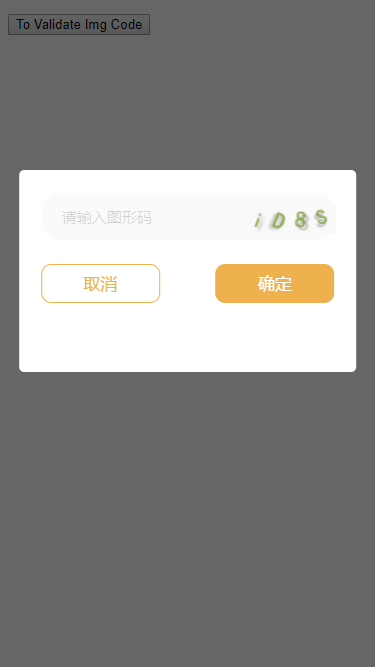

## vue移动端图片验证码弹出层插件



## 使用

```vue

<template>
  <div>
    <button @click="show">To Validate Img Code</button>

    <!--  -->
    <mulo-imgcode ref="imgcode" @success="success" :showerr="showerr"></mulo-imgcode>
  </div>
</template>

<script>
/* eslint-disable */
import ImgCode from 'mulo-imgcode'
export default {
  components: {
    [ImgCode.name]:ImgCode
  },
  created() {},
  methods: {
    // open imgcode validate
    show() {
      this.$refs.imgcode.show();
    },
    //validate successed action
    success() {
      alert('验证成功');
    },
    //show error msg
    showerr(msg) {
      alert(msg);
    }
  }
};
</script>

<style lang="scss" scoped>
</style>

```